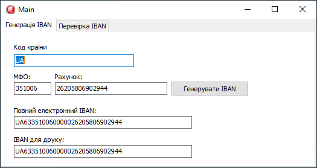
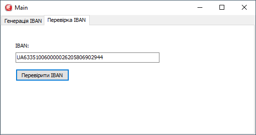

# VCL-Valid-IBAN
Delphi VCL Lib Valid and Generate IBAN.

## Compatibility
All EU countries using the [IBAN](https://es.wikipedia.org/wiki/International_Bank_Account_Number) (International Bank Account Number)
Ukrainian standard of [IBAN](https://bank.gov.ua/ua/iban)

## Sample

